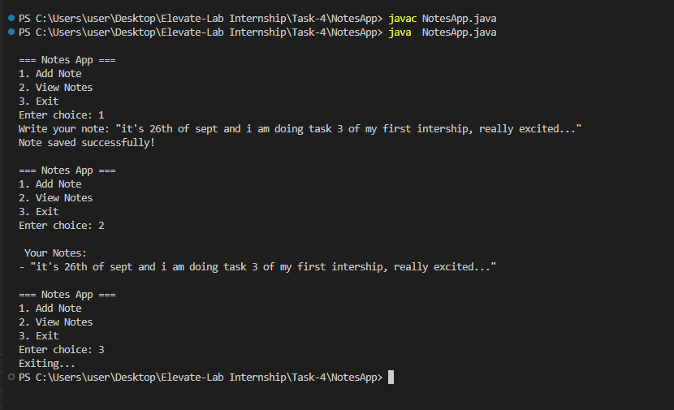

# 📝 Java Notes App

A simple text-based Notes Manager built in Java using File I/O.
This app allows you to add and view notes that are stored in a local text file.

## Features

Add notes from terminal

View all saved notes

Notes stored in notes.txt file

Persistent storage using FileWriter/FileReader/BufferedReader

## Screenshots

## Tools & Requirements

Java JDK (8 or later)

VS Code / IntelliJ IDEA CE (or any Java editor)

Terminal / Command Prompt
